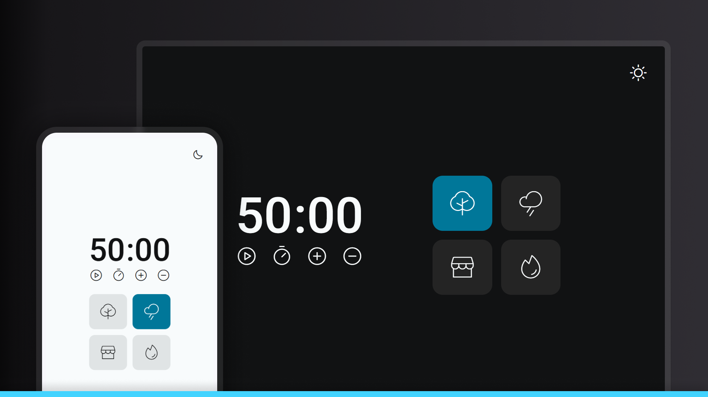

# 🍅 Pomodoro Timer

This is a web application for time management based on the Pomodoro Technique, a productivity method that uses focused work periods interspersed with short breaks.



## 🚀 Features

- ⏱️ Configurable timer (up to 60 minutes)
- ▶️ Start, pause, and reset controls
- ➕ Add or subtract 5 minutes from the timer
- 🌙 Toggle between light and dark themes
- 🔊 Relaxing ambient sounds to improve focus:
  - Forest sounds
  - Rain sounds
  - Coffee shop sounds
  - Fireplace sounds
- 🔔 Sound alert when the timer finishes

## 🛠️ Technologies Used

- **HTML5** - Semantic page structure
- **CSS3** - Styling and responsive layout
- **JavaScript (ES6+)** - Programming logic and interactivity
- **JS Modules** - Code organization into reusable modules
- **Phosphor Icons** - Icon library

## 📚 Applied Concepts

### HTML

- HTML5 semantics
- Accessibility with SR-only class (Screen Reader only)
- Meta tags for SEO and responsiveness

### CSS

- CSS variables for themes (light/dark)
- Responsive units (clamp, rem, vw)
- Media queries for responsive design
- Flexbox and Grid for layout
- Transitions and animations

### JavaScript

- Modular programming with ES6 modules
- DOM manipulation
- Event listeners and event delegation
- Application state management
- Audio manipulation
- Timer with setInterval/setTimeout
- Flow control and validation
- Ternary operators and destructuring

## 📋 Project Structure

```
├── assets/
│   ├── audio/       # Audio files for ambient sounds
│   └── images/      # Images and favicon
├── css/
│   └── style.css    # Application styles
├── js/
│   ├── Timer/
│   │   ├── actions.js     # Timer actions
│   │   ├── elements.js    # DOM element references
│   │   ├── events.js      # Event handlers
│   │   ├── index.js       # Timer module entry point
│   │   ├── sounds.js      # Sound controls
│   │   ├── state.js       # State management
│   │   └── timer.js       # Timer logic
│   ├── main.js            # Main JavaScript file
│   └── toggle-mode.js     # Theme toggle logic
└── index.html             # Main HTML file
...
```

## 🌐 Demo

Access the online version: [Pomodoro Timer](https://maurodiogodev.github.io/Temporizador/)

## 🌟 Learnings and Challenges

During the development of this project, I learned how to:

- Implement module-based architecture pattern
- Manage application state in an organized way
- Create light/dark themes with CSS
- Manipulate audio in web applications
- Work with timers and counters in JavaScript
- Create responsive and accessible interfaces

## 📝 Next Steps

- [ ] Add session history
- [ ] Implement desktop notifications
- [ ] Add option to configure pomodoro cycles
- [ ] Create usage statistics
- [ ] Improve accessibility

Design UI/UX by [Rocketseat](https://www.rocketseat.com.br/)

---

<div align="center"> <p>Developed with ❤️ as part of my web development learning journey.</p> <p>Feel free to contribute or get in touch!</p> </div>
